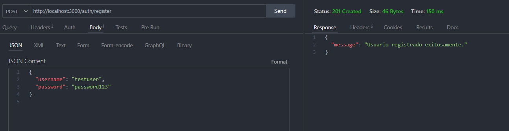
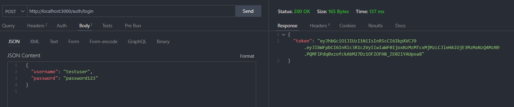

# API de Autenticación con JWT

Esta API permite registrar usuarios, iniciar sesión y acceder a rutas protegidas utilizando tokens JWT. La aplicación está desarrollada con **Node.js**, **Express**, **TypeScript** y conectada a una base de datos PostgreSQL.

## Rutas Implementadas

- **POST /auth/register**: Registra un nuevo usuario.
- **POST /auth/login**: Inicia sesión y devuelve un token JWT.
- **GET /protected**: Accede a datos protegidos. Requiere autenticación con JWT.

---

## Pruebas Realizadas

Las pruebas se realizaron utilizando **Thunder Client** en Visual Studio Code.

### 1. Registro de Usuario

### 2. Iniciar sesión

### 3. Acceso a Rutas Protegidas

